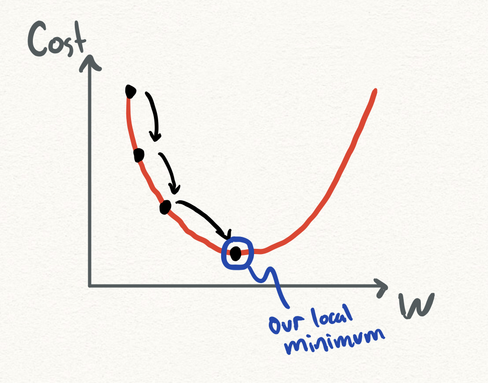
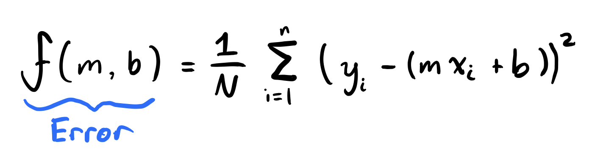
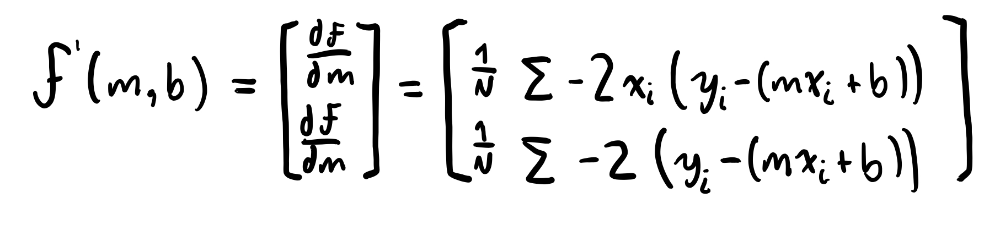

<h1 align="center">
    :arrow_down: Gradient Descent
</h1>

# Overview 

Gradient descent is an optimization algorithm that is used to minimize some function. It does so by iteratively moving in the direction of the steepest descent as defined by the negative of the gradient (slope at a specific point). In ML, we can use gradient descent to update the parameters of our model. Parameters refer to coefficients in Linear/Multivariate regression and weights in neural networks. 

* First, we take out first step downhill in the direction specified by the negative gradient at our beginning point.

* Next we recalculate the negative gradient passing in the coordinates of our new point and take another step in the direction it specifies

* We continue the process iteratively until we that the bottom of our graph to a point we can no long move downhill. This is the ***local minimum***.

In summary, we are iteratively stepping downhill specified by the steepest negative gradient at each point until we have reached our local minimum which is the lowest point of our cost function.



## Learning Rate

The size of each step (each iteration) is called the ***learning rate***. With a high learning rate, each step is larger but we run the risk of overshooting the local minimum since the slope of the hill is constantly changing.

With a low learning rate, we can be more precise, but calculating the negative gradient is more time consuming, since it takes us longer to get to the bottom.

## Cost Function

First, we will use ***linear regression*** for simplicity to solidify the concepts.

A loss function tells us how good our model is at making predictions for a given set of parameters. The cost function has its own curve and gradients. The slope of the curve tells us how to update our parameters to make the model more accurate.

There are two parameters in our cost function we can control: m(weight) and b(bias). Since we need to consider the impact each one has on the final prediction, we need to use partial derivatives. We calculate the partial derivatives of the cost function with respect to each parameter and store the results in a gradient.

We are looking for lines that fit our data better (where better is defined by our error function). If we minimize this function, we get the best line for our data. Our error formula for linear regression is just the sum of the differences between each y and our linear regression prediction squared divided by the number of observations.

#### Math



#### Code
```
# y = mx + b
# m is slope (weight), b is y intercept (bias)
def compute_error(b, m, X, Y):
    total_error = 0
    for i in range(0, len(points)):
        total_error += (Y[i] - (m * X[i] + b))
    return total_error / float(len(points))
```

The gradient can be calculated as:



#### Code

```
def gradient_step(m, b, X, Y, learning_rate):
    m_gradient = 0
    b_gradient = 0
    N = len(X)
    for i in range(N):
        # Calculate partial derivatives
        # -2x(y - (mx + b))
        
        m_gradient += -2 * X[i] * (Y[i] - (m*X[i] + b))

        # -2(y - (mx + b))
        b_gradient += -2 *(Y[i] - (m*X[i] + b))

    # We subtract because the derivatives point in direction of steepest ascent
    m -= (m_deriv / float(N)) * learning_rate
    b -= (b_deriv / float(N)) * learning_rate

    return m, b
```

Sources & Thanks To

<sub><sup>Intro to Gradient Descent & Linear Regression (Matt Nedrich)</sup></sub><br>
<sub><sup> (Matt Nedrich)</sup></sub><br>

